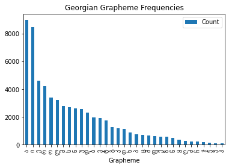
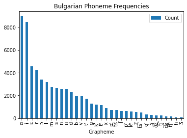
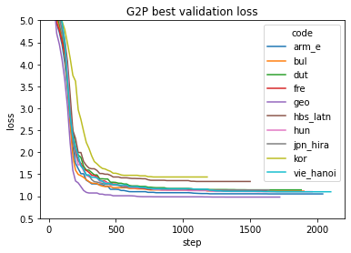
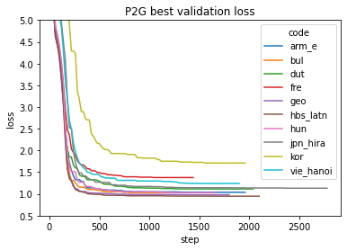
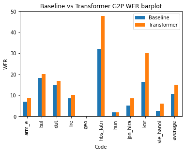
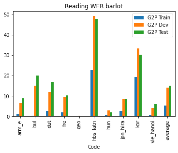
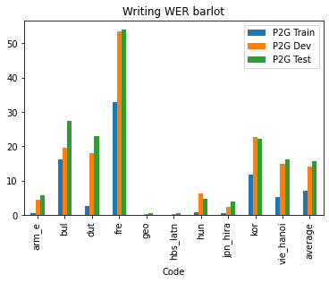
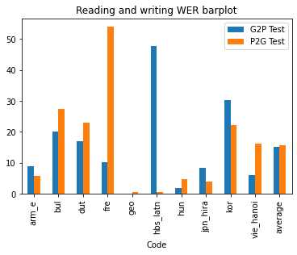
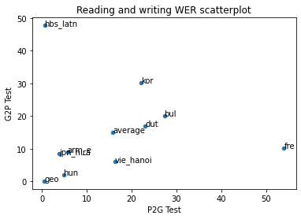

# Comparing Writing Systems with Multilingual Grapheme-to-Phoneme and Phoneme-to-Grapheme Conversion

**Julen Etxaniz**

**University of the Basque Country**

## Abstract

Writing systems in the world vary from highly regular ones to highly irregular ones. The orthographic depth of a language indicates how much it deviates from on-to-one letter to sound correspondence. In this work, we estimate the depth of 10 languages, based on the SIGMORPHON 2021 medium-resource data. For each language, we train a transformer model in grapheme-to-phoneme and phoneme-to-grapheme tasks. The scores in each task can be used to estimate the transparency of languages regarding reading and writing.
## Introduction

The orthographic depth of an orthography indicates the degree to which a written language deviates from simple one-to-one grapheme (letter) to phoneme (sound) correspondence. Based on this, we can define two main types of orthographies, shallow and deep.

Shallow (transparent) orthographies, have a one-to-one relationship between its graphemes and phonemes, and the writing and reading of letters is very consistent. Spanish and Basque are examples of transparent orthographies (Goswami, 2006).

In contrast, in deep (opaque) orthographies, the relationship is less direct, and the writer or reader must learn the arbitrarily irregular words. English and French are considered to have opaque orthographies (Goswami, 2006).

There are also some languages that are asymmetric regarding reading and writing. Two clear examples of this that will be analysed in this work are French and Serbo-Croatian (Latin). Serbo-Croatian (Latin) is very transparent with respect to writing but very opaque regarding reading. The opposite happens in French, which is very opaque in reading and quite shallow in writing.

Languages that have transparent orthographies are easier to learn (Goswami, 2006). If a language is opaque in reading, new learners will have more problems learning to read. Similarly, new learners will learn to write faster in languages that are transparent regarding writing.

Sequence-to-sequence models are very good at picking up on consistent patterns. Therefore, a model should learn the regular writing systems much better than the irregular ones. That means that the performance of seq2seq models could be used as a measure of regularity of a writing system. The grapheme-to-phoneme (G2P) direction would suggest the difficulty of reading a language. Similarly, in the phoneme-to-grapheme (P2G) direction we would be looking at the inconsistencies of writing a language.

We use the transformer proposed in Wu et al. (2021) to compare the orthographies of 10 languages: Armenian (Eastern), Bulgarian, Dutch, French, Georgian, Serbo-Croatian (Latin), Hungarian, Japanese (Hiragana), Korean and Vietnamese (Hanoi). We use same data of the medium-resource languages from the SIGMORPHON 2021 G2P task (Ashby et al., 2021). We train a different model for each task and language, so there are 20 models in total.

The goal is not to build a perfect G2P and P2G system. Instead the goal is to build a translator which can indicate a degree of transparency and thus make it possible to rank orthographies. We do not have to translate a
sequence of words into another sequence of words, our model only requires translating a single word. Therefore, we can consider G2P and P2G as two translation tasks and apply the transformer at character level.

## Related works

Sequence-to-sequence models have been proven to be very successful on language translation tasks. Recently, attention (Bahdanau et al., 2016), transformers (Vaswani et al., 2017) and generative pre-training (Radford and Narasimhan, 2018) have improved the performance of seq2seq models. Applying the transformer to character-level transduction tasks such as G2P has been proved to be a good option (Wu et al., 2021). It was one of the baselines in the SIGMORPHON 2020 G2P task (Gorman et al., 2020).

Many studies have discussed the transparency of orthographies based on the ease of reading and writing when learning a new language (Borleffs
et al., 2017). However, there is not much work that use some of the previously mentioned seq2seq models to measure the level of transparency of orthographies.

In a recent work, a minimalist GPT implementation was used to compare 17 orthographies (Marjou, 2021) on the same G2P and P2G tasks. A unique multi-orthography model was trained to learn the writing and reading tasks on all languages at the same time. In other words, a single dataset containing samples of all studied orthographies was used.

## Material and methods

In order to compare the transparency of languages,multiple steps were needed: collecting data, prepro-cessing, training and testing.  The Fairseq toolkitwas used for these steps (Ott et al., 2019). All thecode and data is available on [GitHub](https://github.com/juletx/writing-systems).

### Data

The SIGMORPHON 2021 G2P medium-resource data is used. It consists of 10,000 words for each of the previously mentioned 10 languages. The data is randomly split into training (80\%), development (10\%), and testing (10\%) files. Files are distinguished by the prefix of each language and subset. Words containing less than two graphemes or less than two phonemes are excluded, as well as words with multiple pronunciations.

This data was extracted from the [English Wiktionary](https://en.wiktionary.org)
using [WikiPron](https://github.com/kylebgorman/wikipron) (Lee et al., 2020). Each
example occupies a single line and consists of a
grapheme Unicode sequence, a tab character, and
the corresponding phoneme IPA sequence, tokenized using the [segments](https://github.com/cldf/segments) library (Moran and Cysouw, 2018).

Reusing the SIGMORPHON data has many advantages. On the one hand, we can compare the results we obtain with the baseline and submissions. On the other hand, it assures that the data we are using is of good quality. In fact, some quality assurance actions have already been applied to the data, to reduce inconsistencies on the initial data. There could still be minor errors, but hopefully the impact of those will be small. This way, the comparison between languages will be as fair as possible.

### Preprocessing

The data had to be preprocessed with fairseq so that it could be used for training. Phonemes are already separated with spaces but graphemes have to be separated on character level. Fairseq requires input and output languages in separate files for training, so we have to divide each file into two. One file will contain graphemes and the other one phonemes. Depending on the task, grapheme and phoneme files will be in the source or target. Therefore, six files are needed for each language: two train, two dev and two test.

A minimum of 5 occurrences is set for each character, and the remaining ones are mapped to unknown. The table below shows the unique and average grapheme and phoneme counts for each language. We can see that there is some variability between languages. Some languages have similar unique grapheme and phoneme counts, while others are unbalanced. Unbalanced languages can't have a one-to-one correspondence between graphemes and phonemes. Even if these counts alone don't explain the results, they give us an idea of the complexity of the languages.

| Language               | Code      |   Unique Graphemes |   Unique Phonemes |   Average Graphemes |   Average Phonemes |
|:-----------------------|:----------|-------------------:|------------------:|--------------------:|-------------------:|
| Armenian (Eastern)     | arm_e     |               38   |              41   |                7.09 |               7    |
| Bulgarian              | bul       |               29   |              45   |                8.44 |               8.64 |
| Dutch                  | dut       |               30   |              45   |                7.71 |               6.99 |
| French                 | fre       |               37   |              37   |                7.52 |               5.75 |
| Georgian               | geo       |               33   |              33   |                7.74 |               7.74 |
| Serbo-Croatian (Latin) | hbs_latn  |               27   |              61   |                7.47 |               7.36 |
| Hungarian              | hun       |               34   |              61   |                7.65 |               7.18 |
| Japanese (Hiragana)    | jpn_hira  |               76   |              64   |                4.21 |               6.56 |
| Korean                 | kor       |              559   |              60   |                2.58 |               6.54 |
| Vietnamese (Hanoi)     | vie_hanoi |               89   |              49   |                5.81 |               7.51 |
| Average                | average   |               95.2 |              49.6 |                6.62 |               7.13 |

Georgian has the same amount of unique and average graphemes and phonemes. We can see in figures below that the frequency distribution of graphemes and phonemes in Georgian is the same.

French also has the same number of unique graphemes and phonemes. However, if we look at the mean counts, we realise that words have more graphemes than phonemes. This means that the relationship cannot be one-to-one.

Hungarian has many more unique phonemes than graphemes. However, the average number of graphemes and phonemes is similar.

Korean is a clear outlier if we look at grapheme counts. There are many unique graphemes, but the mean grapheme count of each words is very low. This means that each grapheme is matched to multiple phonemes.

### Training

We used fairseq to define the parameters of the model and to train it. The parameters of the transformer are the ones defined in Wu et al. (2021) with a few changes. This transformer is smaller than usual because our character-level dataset is small and each example consists of a few tokens. It has 4 encoder-decoder layers and 4 self-attention heads. The embedding size is 256 and the hidden size of the feed-forward layer is 1024. The resulting models have around 7.4M parameters.

ReLU was used as an activation function for the feed-forward layers. We use Adam optimizer with a learning rate of 0.001 and an inverse square root learning rate scheduler. We used a batch size of 400 and a the dropout rate is set to 0.1. Label smoothing of 0.1 is also applied. Early stopping with a patience of 20 epochs was added to reduce training time and avoid overfiting. Only best and last model checkpoints are saved, but only the best model is used for evaluation.

The training was done using the free GPUs offered by Google Colab. Each task was trained on a separate day with different GPUs. On the one hand, a Tesla K80 GPU was used for the G2P task, resulting in training times of around 10 minutes for each model. On the other hand, the P2G models were trained using a Tesla T4 GPU, reducing training times to around 5 minutes per model.

The training process was monitored using TensorBoard and can be consulted in [TensorBoard.dev](https://tensorboard.dev/experiment/mcrHkdndR0ySobcxV1UxVA). Learning curves of all the models can also be seen in figures below. The biggest improvement in loss happens in the first 500 steps. From there, the improvement in loss is small and there is a point where validation loss starts increasing. That is why early stopping makes sense in this case.

We can also note that there are some differences between languages. As we use early stopping, each language is trained for a different number of epochs. For most languages around 2000 steps are enough to reach the best validation loss.

### Testing

Fairseq is used to make predictions using the best model checkpoint od each language. Beam search with a beam size of 5 is used to make predictions for each of the subsets. Based on those predictions, train, dev and test scores are computed for each language. Average scores are also computed for each task and subset.

The metric used to rank systems is word error rate (WER), the percentage of words for which the predicted sequence does not match the gold sequence. The average WER was also calculated for each task. This is the same metric that was used in SIGMORPHON 2021 Task 1, which allows comparing results with the baselimne. WER is a usually a good metric for tasks of this type.

## Results

First, we will compare the G2P results with the SIGMORPHON 2021 baseline. This is important to know if our model is good enough for our aim. We want the models to at least learn the regular patterns in the orthographies of languages. Then, we will compare all languages taking into account all the results. We will try to rank and group languages based on the results. Finally, we will compare our results with the ones obtained in the previous work Marjou (2021).

### Comparison with baseline

The baseline for the SIGMORPHON 2021 G2P task is a neural transducer system using an imitation learning paradigm (Makarov and Clematide,
2018). Alignments are computed using ten iterations of expectation maximization, and the imitation learning policy is trained for up to sixty epochs (with a patience of twelve) using the Adadelta optimizer. A beam of size of four is used for prediction. Final predictions are produced by a majority-vote ten-component ensemble.

The G2P results are compared with the baseline results on the dev and test sets in the table and figure below. The results are worse in all languages but the ranking between languages is maintained. The biggest differences are found in the languages that get the worst results, Serbo-Crotian (Latin) and Korean. If we compare the mean results, we can see that out model is 5 points worse than the baseline on average. As we said before, our aim is not to get perfect results, so our model is good enough.

| Code      |   Baseline Dev |   Transformer Dev |   Baseline |   Transformer |
|:----------|---------------:|------------------:|-----------:|--------------:|
| arm_e     |           4.5  |               6.5 |       7    |          8.9  |
| bul       |           8.3  |              14.9 |      18.3  |         20.1  |
| dut       |          10.8  |              12   |      14.7  |         16.9  |
| fre       |           7.4  |               9.5 |       8.5  |         10.2  |
| geo       |           0    |               0.3 |       0    |          0.1  |
| hbs_latn  |          34.7  |              49.2 |      32.1  |         47.7  |
| hun       |           1.5  |               2.8 |       1.8  |          1.9  |
| jpn_hira  |           6.2  |               8.4 |       5.2  |          8.5  |
| kor       |          18.4  |              33.4 |      16.3  |         30.2  |
| vie_hanoi |           1.3  |               4   |       2.5  |          6    |
| average   |           9.31 |              14.1 |      10.64 |         15.05 |

### Comparison between languages

Results for each task, language and subset are shown in table below. The results for each task can be seen in figures below. We will try to rank and group languages based on the results. We will also compare our results with the ones obtained in previous works.

| Code      |   G2P Train |   G2P Dev |   G2P Test |   P2G Train |   P2G Dev |   P2G Test |
|:----------|------------:|----------:|-----------:|------------:|----------:|-----------:|
| arm_e     |        1.16 |       6.5 |       8.9  |        0.57 |      4.4  |       5.7  |
| bul       |        0.34 |      14.9 |      20.1  |       16.25 |     19.7  |      27.3  |
| dut       |        2.59 |      12   |      16.9  |        2.67 |     18    |      23    |
| fre       |        2.04 |       9.5 |      10.2  |       32.96 |     53.5  |      54    |
| geo       |        0.06 |       0.3 |       0.1  |        0.12 |      0.3  |       0.5  |
| hbs_latn  |       22.56 |      49.2 |      47.7  |        0.09 |      0.2  |       0.6  |
| hun       |        0.64 |       2.8 |       1.9  |        0.84 |      6.2  |       4.8  |
| jpn_hira  |        2.74 |       8.4 |       8.5  |        0.59 |      2.4  |       3.9  |
| kor       |       19.27 |      33.4 |      30.2  |       11.84 |     22.8  |      22.1  |
| vie_hanoi |        0.44 |       4   |       6    |        5.35 |     15    |      16.3  |
| average   |        5.18 |      14.1 |      15.05 |        7.13 |     14.25 |      15.82 |

As expected, training set results are much better than development and test set results, which are similar. Even though there is a big difference, we can say that our model seems to be generalizing quite well in most cases. Most of the times the training WER is close to 0, but there are some cases where the model doesn't even get good results in the training set.

If we compare the mean results we can see that both tasks are similar in difficulty. On average, a WER of around 15 is achieved in the development and test sets in both tasks. However, if we look closer at each result, we can see that there is a big difference between languages and tasks.

If we only look at test results, we can plot the G2P and P2G scores of each language together in figures below. This way, we can compare all languages based on reading and writing tasks. If we plot them in a scatter plot, we can see how close languages are between them in figures below. We can use this to rank languages based on their transparency in reading and writing. We can also group languages that get similar results.

First, Georgian gets almost perfect results both in reading and writing, which confirms that it has a very transparent orthography. Hungarian gets the second best results, with less than 5\% WER in both tasks.

Japanese (Hiragana) and Armenian (Eastern) have similar scores, with a reading score of around 5\% and a writing score that is close to 10\%. Next is Vietnamese (Hanoi) which has a much better score on reading (6.00) than on writing (16.30).

Dutch and Bulgarian have reading score of around 20 and writing scores of more or less 25. Korean also gets bad results both in reading (30.20) and on writing (22.10).

Finally, we can see that Serbo-Croatian and French are outliers. On the one hand, Serbo-Croatian gets very good score in writing (0.60) and very bad (47.7) in reading. On the other hand, French reading score is very bad (54.00), but writing score is better than average (10.20).

### Comparison with related works

We can also compare these results with the ones obtained in Marjou (2021). On the one hand, their results show that Chinese, French, English and Russian are the most opaque regarding writing. English and Dutch are the most opaque regarding reading. On the other hand, they indicate that Esperanto, Arabic, Finnish, Korean, Serbo-Croatian and Turkish are very shallow both to read and to write. Italian, Breton, German, Portuguese and Spanish are shallow to read and to write.

If we take a look at the common languages, we realise that not all results match. French results are similar, with a good reading score and very bad writing score. Dutch scores are the other way around, we get a better score in reading. Korean scores are worse in both tasks and Serbo-Croatian gets much worse results in the reading task.

These differences could be mainly attributed to the differences in the data used. In fact, some inconsistencies in the data have been previously reported. Moreover, if we compare the grapheme and phoneme counts in Korean and Serbo-Croatian we will see that they are very different. The reason for this could be the use of a different alphabet. For example, Latin alphabet is used for Serbo-Croatian in our case. Finally, using a single model instead of a unique model for each language and task could also have an impact.

## Conclusions

A recent work approached the same problem using a single model for both tasks and all languages (Marjou, 2021). This time, we decide to use the opposite approach, training a different model for each task and language. 

Nonetheless, most of the results obtained are similar in both cases. Moreover, both results resemble the ones obtained in other studies. This suggests that these types of models can estimate the orthographic depth of languages quite accurately.

However, it is necessary to fix the inconsistencies in the entries of some languages to have more accurate results. These inconsistencies have a big impact in the results of some languages. For example, Georgian WER score improved from 24.89 in SIGMORPHON 2020 (Gorman et al., 2020) to 0 in 2021. Therefore, quality assurance work such as the one done in SIGMORPHON 2021 is very important (Ashby et al., 2021).

Moreover, as these inconsistencies usually cause errors in the predictions, these models could also be used to detect inconsistencies. For example, languages with transparent orthographies such as Georgian are expected to get very good results. If we get bad results and look at the errors, we might find the inconsistencies that are causing them. Then we could fix them to improve the quality of the data and get more accurate results.

These methods could be applied to many other languages to make a broader classification of languages. There are many more languages in Wiktionary that have at least 10,000 entries. In fact, we can find many languages with more than 100,000 words, and very few with more than 1,000,000. However, there is a limitation in the available data for smaller languages. There are many languages that have less than 10,000 entries, and others with less than 1,000.

## References

* Lucas F.E. Ashby, Travis M. Bartley, Simon Clematide,
Luca Del Signore, Cameron Gibson, Kyle Gorman,
Yeonju Lee-Sikka, Peter Makarov, Aidan Malanoski,
Sean Miller, Omar Ortiz, Reuben Raff, Arundhati
Sengupta, Bora Seo, Yulia Spektor, and Winnie Yan. 2021. Results of the second SIGMORPHON shared
task on multilingual grapheme-to-phoneme conversion.
In Proceedings of the 18th SIGMORPHON
Workshop on Computational Research in Phonetics,
Phonology, and Morphology, pages 115–125, Online.
Association for Computational Linguistics.

* Dzmitry Bahdanau, Kyunghyun Cho, and Yoshua Bengio. 2016. Neural machine translation by jointly
learning to align and translate.

* Elisabeth Borleffs, Ben AM Maassen, Heikki Lyytinen,
and Frans Zwarts. 2017. Measuring orthographic
transparency and morphological-syllabic complexity
in alphabetic orthographies: a narrative review.
Reading and writing, 30(8):1617–1638.

* Kyle Gorman, Lucas F.E. Ashby, Aaron Goyzueta, Arya
McCarthy, Shijie Wu, and Daniel You. 2020. The
SIGMORPHON 2020 shared task on multilingual
grapheme-to-phoneme conversion. In Proceedings
of the 17th SIGMORPHON Workshop on Computational
Research in Phonetics, Phonology, and Morphology,
pages 40–50, Online. Association for Computational
Linguistics.

* Usha Goswami. 2006. Orthography, phonology, and
reading development: A cross-linguistic perspective.
Handbook of orthography and literacy, pages 463–480.

* Jackson L. Lee, Lucas F.E. Ashby, M. Elizabeth Garza,
Yeonju Lee-Sikka, Sean Miller, Alan Wong, Arya D.
McCarthy, and Kyle Gorman. 2020. Massively multilingual
pronunciation modeling with WikiPron. In
Proceedings of the 12th Language Resources and
Evaluation Conference, pages 4223–4228, Marseille,
France. European Language Resources Association.

* Peter Makarov and Simon Clematide. 2018. Imitation
learning for neural morphological string transduction.
In Proceedings of the 2018 Conference on Empirical
Methods in Natural Language Processing, pages
2877–2882, Brussels, Belgium. Association for Computational
Linguistics.

* Xavier Marjou. 2021. Oteann: Estimating the transparency
of orthographies with an artificial neural network.
Proceedings of the Third Workshop on Computational
Typology and Multilingual NLP.

* Steven Moran and Michael Cysouw. 2018. The Unicode
Cookbook for Linguists: Managing writing systems
using orthography profiles. Language Science Press.

* Myle Ott, Sergey Edunov, Alexei Baevski, Angela Fan,
Sam Gross, Nathan Ng, David Grangier, and Michael
Auli. 2019. fairseq: A fast, extensible toolkit for
sequence modeling. In Proceedings of NAACL-HLT
2019: Demonstrations.

* Alec Radford and Karthik Narasimhan. 2018. Improving
language understanding by generative pretraining.
In OpenAI Tech Report.

* Ashish Vaswani, Noam Shazeer, Niki Parmar, Jakob
Uszkoreit, Llion Jones, Aidan N. Gomez, Lukasz
Kaiser, and Illia Polosukhin. 2017. Attention is all
you need.

* Shijie Wu, Ryan Cotterell, and Mans Hulden. 2021.
Applying the transformer to character-level transduction.
